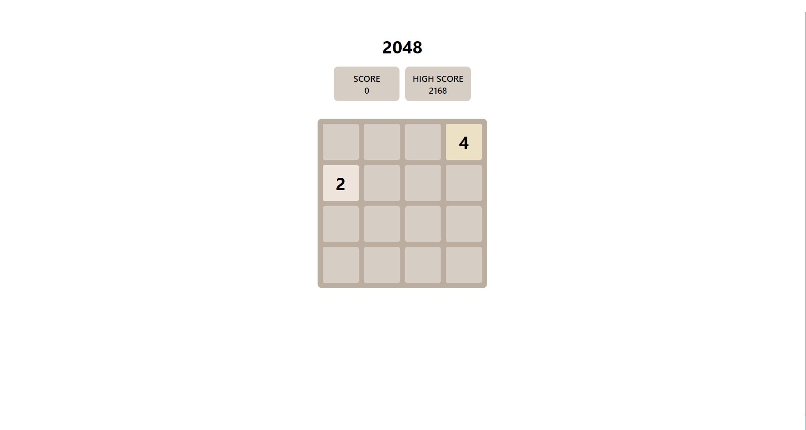

# 2048 Game Clone

A clone of 2048 game using **HTML**, **CSS** and **JavaScript**. Reach 2048 by combining the same numbers.

### Usage

Press the arrow keys or A, S, D and F keys to move the tiles in the board. The goal of the game is to reach 2048, it can still be played beyond that.

#### 1. Utilities

| S.N | Function     | Usage                                                          |        Params |
| --- | ------------ | -------------------------------------------------------------- | ------------: |
| 1.  | removeZeros  | removes all the zeros form a 1D array                          |         array |
| 2.  | addZeros     | adds zeros until the 1D array is full                          | array, column |
| 3.  | isNotSame    | checks if the previous board and the current board is the same |  board, board |
| 4.  | transpose    | transposes a matrix i.e. a 2D array                            |         board |
| 5.  | chooseRandom | returns a random number from an array                          |         array |

#### 3. Constants

| S.N | Constants   | Usage                                               | Default Value |
| --- | ----------- | --------------------------------------------------- | ------------: |
| 1.  | ROWS        | The number of rows the board will have              |             4 |
| 2.  | COLUMNS     | The number of columns the board will have           |             4 |
| 3.  | SCORE       | The score the player will accumulate                |             0 |
| 4.  | BOARD_ARRAY | The actual values of the tiles mapped in a 2D array |               |

### Screenshot

